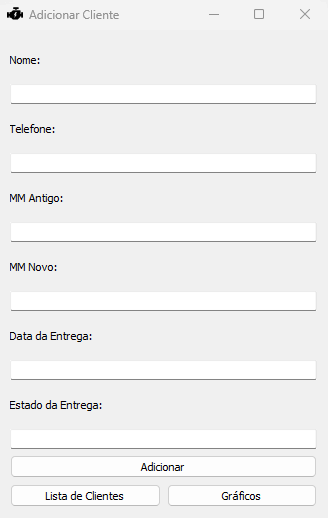
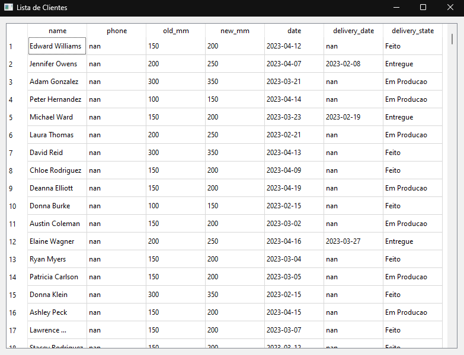
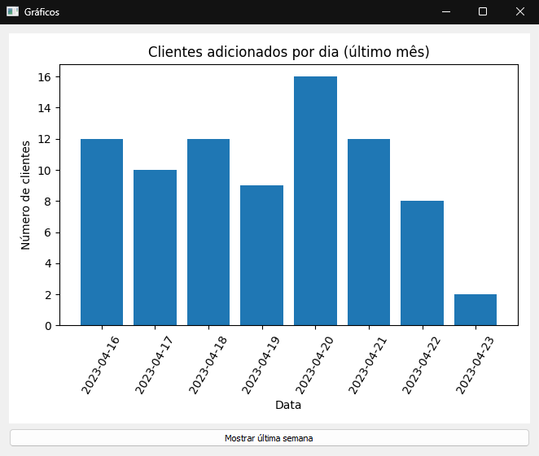

# Retificadora
Um programa feito para uma empresa que faz retificações.

## Tabela de Conteúdo
* [Informações Gerais](#informações-gerais)
* [Screenshots](#screenshots)
* [Ferramentas](#ferramentas)
* [Tecnologias](#tecnologias)
* [Setup](#setup)
* [Status](#status)
* [Contato](#contato)
* [Licença](#licença)
* [Contribuir](#contribuir)

## Informações Gerais
Um programa que eu fiz com Python e PyQt5 com foco em visualização de dados feito para uma empresa que realiza retificações.

## Screenshots

Tela de Início
:-------------------------:

Lista de Clientes
:-------------------------:

Gráficos
:-------------------------:

## Ferramentas

* Tela de Login
* Adição de Clientes
* Checagem dos Clientes
* Gráficos interativos

## Tecnologias
* Python 3.11
* PyQt5

## Setup

Para usar o aplicativo você precisa desses dois passos:

#### 1. Requerimentos
  - Um Computador com Windows  7/8/10/11

#### 2. Abra o programa!

Eu fiz o programa de uma forma que roda em qualquer dispositivo Windows(eu espero).

## Status
O projeto está: _Finalizado_

## Contato
Feito por [phoon](https://ayo.so/phoon) - Não me mande mensagem! (Só se for importante)

## Licença
>Leia o arquivo de licença [aqui](https://github.com/phoonsz/retifica/blob/master/LICENSE.md)

Esse projeto é licenciado sob a Licença MIT.

## Contribuir

1. Faça um fork do projeto [Aqui](https://github.com/phoonsz/retifica)
2. Faça a sua própria branch (`git checkout -b feature/fooBar`)
3. Coloque as suas mudanças (`git commit -am 'Add some fooBar'`)
4. Salve as na sua branch (`git push origin feature/fooBar`)
5. Crie um Pull Request para que eu confira e adicione.
